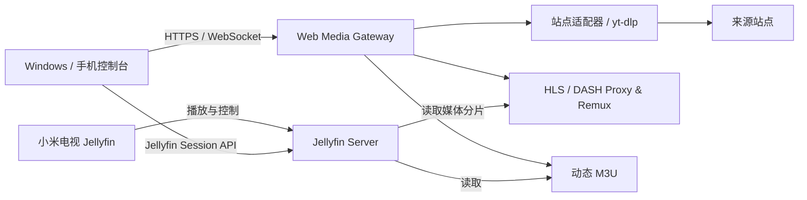
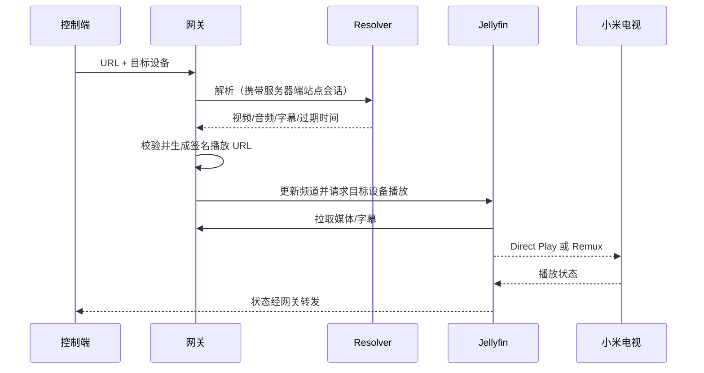

# 系统设计

## 1. 架构决策摘要

系统采用旁路网关，不修改 Jellyfin Server 核心。Jellyfin 继续负责设备、用户、播放会话和客户端兼容；网关只负责网页媒体解析、会话保护和临时媒体代理。



## 2. 组件

### 2.1 Control Console

- 单页 PWA，由网关托管。
- 负责 URL 输入、设备选择、登录流程、播放状态和错误展示。
- 不直接接触媒体 Cookie；控制台只持有网关会话。

### 2.2 Gateway API

- 建议使用 Rust + Axum。
- 负责鉴权、任务生命周期、限流、SSRF 防护和状态事件。
- 使用 SQLite 保存非敏感配置、任务元数据和审计事件。

### 2.3 Session Vault

- 按站点隔离 Cookie 与必要凭据。
- 密钥不与数据库放在同一文件中。
- 仅解析子进程按最小权限读取目标站点会话。

### 2.4 Resolver

- 统一接口屏蔽 yt-dlp 与未来站点适配器差异。
- 输出标准 `ResolvedMedia`，包括视频、音频、字幕、请求头、过期时间和 DRM 判断。

```text
ResolvedMedia
├── title
├── duration
├── video variants
├── audio variants
├── subtitle tracks
├── required headers (server only)
├── expires_at
└── drm / unsupported reason
```

### 2.5 Media Gateway

- 能直接播放时代理原始媒体，避免处理内容字节。
- 分离音视频时用 FFmpeg remux，不重新编码。
- 对 Jellyfin 暴露短期、签名化的本地 URL。
- 上游 Cookie 和 Authorization 永不下发给客户端。

### 2.6 Jellyfin Adapter

- 生成单一动态 M3U Tuner，例如“网页播放”。
- 调用 Jellyfin API 发现客户端、发送播放命令并读取会话状态。
- 使用专用、最小权限 Jellyfin 用户或 API Key。

## 3. 主要数据流

### 3.1 Direct Stream / Remux



### 3.2 浏览器捕获（非 MVP）

浏览器捕获需要 Chromium 渲染、音画捕获和 H.264 实时编码。在当前 Snapdragon 865 Ubuntu chroot 中缺少稳定硬件编码接口，因此只保留技术验证，不作为默认回退。

若未来实现，应作为独立 worker：

```text
Chromium profile
→ isolated display/audio
→ capture
→ encoder
→ low-latency stream
```

它不能绕过 DRM，且 HLS 不适合低延迟网页交互。

## 4. API 草案

```text
POST   /api/v1/jobs                 创建解析任务
GET    /api/v1/jobs/{id}            获取任务状态
DELETE /api/v1/jobs/{id}            停止并清理任务
GET    /api/v1/devices              获取 Jellyfin 显示设备
POST   /api/v1/devices/{id}/play    在目标设备播放
POST   /api/v1/devices/{id}/control 播放/暂停/停止/跳转
GET    /api/v1/sites                获取站点会话状态
POST   /api/v1/sites/{site}/login   启动服务器端登录流程
GET    /live/channels.m3u            Jellyfin M3U Tuner
GET    /stream/{token}/...           临时媒体代理
WS     /api/v1/events                任务与播放状态
```

所有路径仅为设计草案，实施前需完成 OpenAPI 契约和威胁审查。

## 5. 状态与存储

```text
/var/lib/web-media-gateway/
├── gateway.sqlite          # 任务、设备映射、非敏感配置
├── sessions/               # 加密的站点会话
├── cache/                  # 有界元数据/清单缓存
└── runtime/                # 临时 M3U、分片与 sockets
```

- 运行目录可放 tmpfs，重启后允许丢失。
- 会话和数据库必须持久化。
- 大型媒体默认不落盘；如需缓存必须设置容量和过期策略。

## 6. 部署

```text
OpenWrt LAN
├── Ubuntu 手机 10.0.0.116
│   ├── Jellyfin :8096
│   └── Gateway  :本地反向代理入口
└── 小米电视 DHCP 保留地址
```

- 控制台和 API 只允许 LAN/Tailscale 管理网络访问。
- 媒体流优先走局域网地址，不绕 Tailscale。
- Jellyfin 与网关独立启动、独立日志和独立故障域。

## 7. 可观察性

记录：解析阶段、持续时间、站点适配器、媒体格式、Direct/Remux/Transcode、错误码和资源使用。

禁止记录：完整 URL 查询 Secret、Cookie、Authorization、字幕正文和账号密码。

