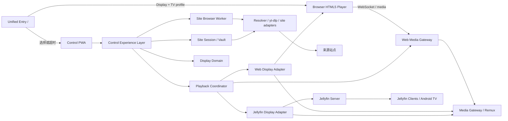
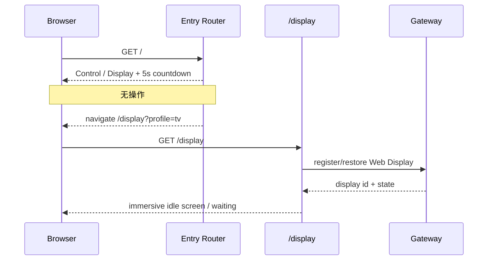
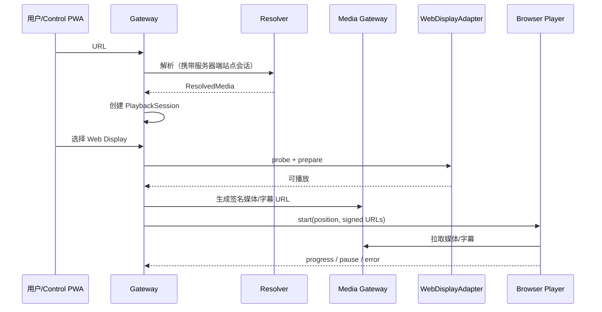
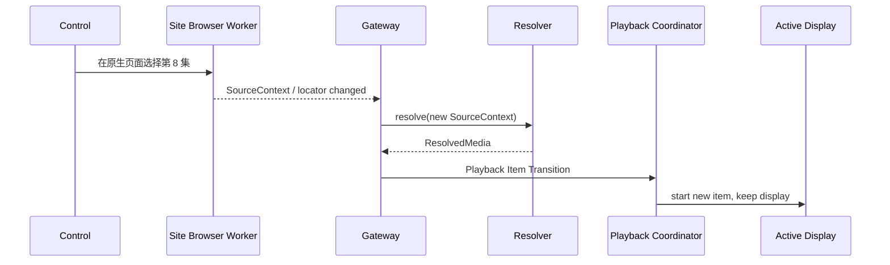
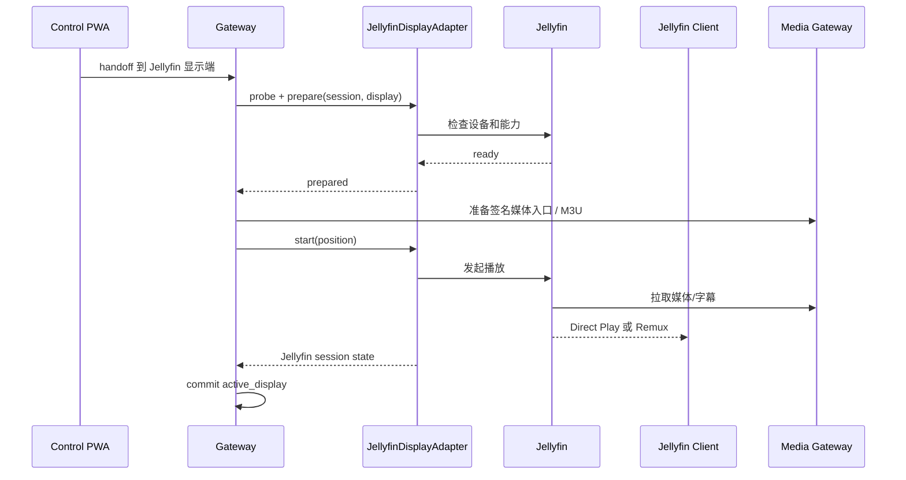

# 系统设计

## 1. 架构决策摘要

系统采用独立 Web Media Gateway，不修改 Jellyfin Server 核心。Gateway 是网页媒体播放任务的权威状态源：负责网页媒体解析、站点会话保护、媒体生命周期、播放状态、`active_display` 和跨显示端 handoff。

最终显示通过可插拔 `DisplayAdapter` 接入。首批支持：

- `WebDisplayAdapter`：浏览器直接消费 Gateway 媒体，不经过 Jellyfin。
- `JellyfinDisplayAdapter`：通过动态 M3U、媒体代理和 Jellyfin API 把同一播放任务交给 Jellyfin 客户端。

Jellyfin 继续负责其自身用户、设备、客户端兼容、媒体库和内部播放会话，但不再充当整个 Gateway 系统的全局播放状态源。

Web UI 使用统一根入口：`/` 负责角色选择，短超时无操作时默认进入 Display + TV profile；`/display` 与 `/control` 作为确定性入口保留。页面角色与显示布局 profile 分开建模，屏幕分辨率只能影响布局，不能决定控制权限或页面角色。

Control 在体验上统一为一个页面，但内部保持 Playback、Source/Site Browser、Site Session、Display 四个控制域分离。`Control Experience Layer` 只聚合各领域状态并路由 Intent，不成为新的状态 authority。



## 2. 核心领域模型

### 2.1 ResolvedMedia

Resolver 输出与显示端无关的标准媒体描述：

```text
ResolvedMedia
├── title
├── duration
├── video variants
├── audio variants
├── subtitle tracks
├── required headers (server only)
├── expires_at
└── drm / unsupported reason
```

`ResolvedMedia` 不包含 Jellyfin 特有字段，也不假设最终由浏览器、电视或其他客户端消费。

### 2.2 PlaybackSession

Gateway 为每次网页媒体播放创建 `PlaybackSession`：

```text
PlaybackSession
├── id
├── resolved_media
├── state
├── position
├── subtitle_selection
├── active_display
├── media_url_expiry
└── adapter_capability_snapshot
```

Gateway 是这些状态的 authority。Display Adapter 可以上报播放状态，但 adapter 的本地会话不是全局真相。

### 2.3 DisplayInstance

显示端统一表示为：

```text
DisplayInstance
├── id
├── adapter_type
├── label
├── online
├── capabilities
├── display_profile
└── adapter_metadata
```

例如：

```text
adapter_type = web
  → 当前 Chromium Display 页面

display_profile = tv
  → 沉浸式大屏布局

adapter_type = jellyfin
  → 小米电视 Jellyfin Android TV
```

核心代码只依赖标准能力，不使用“如果是电视 / 如果是浏览器”的分支表达业务规则。

### 2.4 PageRole 与 DisplayProfile

Web 页面角色和显示布局必须分开建模：

```text
PageRole
├── control
└── display

DisplayProfile
├── tv
├── desktop
├── mobile
└── auto
```

规则：

- URL、用户选择或已保存的 `preferred_role` 决定 `PageRole`。
- viewport、输入能力、媒体能力以及用户显式选择可以影响 `DisplayProfile`。
- 分辨率不得被用来推导控制权限。
- `/` 超时默认得到 `PageRole=display` 与 `DisplayProfile=tv`。
- `/display` 是专用显示入口；首版默认 TV-oriented profile，并允许显式覆盖。
- `/control` 始终进入控制角色；只有用户执行“在本机播放”时才额外注册当前浏览器为 `DisplayInstance`。

### 2.5 SourceContext

站点原生页面与 Gateway 播放核心之间使用稳定来源上下文，而不是直接共享站点播放器内部状态。

```text
SourceContext
├── site_id
├── source_locator
├── title
├── collection_metadata
├── episode_metadata
└── site_metadata
```

`SourceContext` 表达“用户想看什么”。

当用户在 Native Site Panel 中选择另一集或另一个视频时，Site Browser Domain 输出新的 `SourceContext`；Resolver 再基于该 locator 创建新的 `ResolvedMedia`。

### 2.6 ControlView

Control Experience Layer 可以聚合一个面向 UI 的只读 ViewModel：

```text
ControlView
├── now_playing
├── playback_controls
├── playback_context
├── active_display
├── site
├── site_account_state
├── native_site_panel
└── action_required
```

`ControlView` 不是业务状态库。

其中：

- 播放位置/状态来自 `PlaybackSession`；
- 当前显示端来自 Display Domain；
- 站点登录状态来自 `SiteSession`；
- 原生站点页面状态来自 `Site Browser Worker`。

## 3. 组件

### 3.0 Unified Entry Router

Gateway 托管一个极轻量入口层，用于把“一个容易记忆的 URL”映射为 Control 或 Display 角色。

默认路由：

```text
GET /
  → 显示模式 / 控制模式选择
  → MVP 默认倒计时 5 秒
  → 无操作：navigate /display?profile=tv

GET /display
  → 直接进入 Display，不等待倒计时

GET /control
  → 直接进入 Control，不等待倒计时
```

实现要求：

- 倒计时仅属于入口 UI，不进入 Playback Coordinator 核心状态机。
- 超时时间可配置；自动化测试不能依赖真实等待，应直接访问确定性入口。
- 可以使用 localStorage 或等价机制保存 `preferred_role`，但必须允许显式切换/清除。
- 角色路由不是安全授权。MVP 仍以可信 LAN / 单用户为信任边界，未来如增加 Gateway Identity，应独立于 PageRole。
- 如果自动跳转失败，入口页必须继续保留可点击按钮。

### 3.1 Control Console

- 单页 PWA，由 Gateway 托管于 `/control`。
- 负责 URL 输入、站点登录、解析进度、当前播放内容、显示端选择、handoff、播放状态和错误展示。
- 不直接接触上游媒体 Cookie。
- 通过 Gateway WebSocket 恢复并同步 `PlaybackSession`。
- 仅打开控制台不会自动注册 Web Display；用户选择“在本机播放”后才注册当前浏览器为显示实例。
- 可提供“打开 Jellyfin Web”入口，但不依赖 Jellyfin Web 完成自身核心流程。
- 当前来源站点支持 Native Site Panel 时，可以在同一个 Control 页面内按需展开站点原生控制区域。

### 3.1.1 Control Experience Layer

`Control Experience Layer` 是 UI 聚合和 Intent 路由层。

职责：

- 聚合 Playback、Source/Site Browser、Site Session、Display 四个领域的可见状态；
- 生成 `ControlView`；
- 把 UI 操作转换为 `PlaybackIntent` 或 `SiteIntent`；
- 将内部错误翻译为用户可理解的状态；
- 在领域状态变化后重新组合 UI。

它不得：

- 自己持久化第二份 PlaybackSession；
- 让站点原生播放器状态直接覆盖 Gateway 播放状态；
- 用一个 UI 操作同时模拟站点按钮并调用 Gateway Playback API 修改同一语义状态。

概念 Intent：

```text
PlaybackIntent
├── Play
├── Pause
├── Seek
├── NextItem
└── Handoff(display_id)

SiteIntent
├── OpenSource(locator)
├── SelectSource(locator)
├── Login(site)
└── NativeAction(...)
```

### 3.2 Gateway API

- 建议使用 Rust + Tokio + Axum。
- 负责播放任务生命周期、显示端注册、handoff、限流、SSRF 防护和状态事件。
- MVP 不引入 Gateway 用户/RBAC，但保留 same-origin、Origin/CSRF、防开放代理等基础安全约束。
- 使用 SQLite 保存非敏感配置、站点信息、审计事件和必要元数据。
- 临时 `PlaybackSession` 可主要驻留内存；如果持久化，只用于故障诊断或未来恢复能力，不作为首个 MVP 要求。

### 3.3 Playback Coordinator

Playback Coordinator 管理 `PlaybackSession` 与 `DisplayAdapter` 之间的状态机。

职责：

- 创建和停止播放任务；
- 维护当前进度、字幕选择和 `active_display`；
- 根据 `ResolvedMedia` 与显示端能力选择 direct / remux / unsupported；
- 协调 adapter 的 prepare、start、pause、seek、stop 和状态回报；
- 执行跨显示端 handoff；
- 处理显示端断线、URL 过期和 adapter 失败。

它不得把 Jellyfin Session API 或 Site Browser Worker 内部播放器直接作为全局状态模型，也不得关心根入口的倒计时逻辑。

### 3.4 Display Adapter Interface

逻辑接口示意：

```text
DisplayAdapter
├── list_or_register_displays()
├── probe(display, media)
├── prepare(session, display)
├── start(session, display, position)
├── pause(display)
├── seek(display, position)
├── stop(display)
├── status(display)
└── subtitle_capabilities(display)
```

具体方法名在实现前通过 Rust trait / OpenAPI 契约确定；这里约束的是边界和职责。

### 3.5 WebDisplayAdapter

- `/display` 是专用显示页面，加载后注册或恢复一个 Web `DisplayInstance`。
- Control 页面只有显式执行本机播放时才注册 Web Display。
- adapter 根据 User-Agent / MediaCapabilities / viewport / pointer / touch 等运行时探测记录浏览器能力与 `DisplayProfile`。
- Gateway 向浏览器签发任务绑定、短期媒体 URL。
- 浏览器直接使用 HTML5 media element 或必要的轻量 HLS 播放层。
- 上游 Cookie、Authorization、真实源 URL 中的敏感参数不下发。
- 播放进度、暂停、结束和错误通过 WebSocket/HTTP 回报 Playback Coordinator。
- Web Display 不要求 Jellyfin 在线。

TV profile 默认行为：

- 页面占满 `100vw × 100vh`，黑色背景；
- 视频使用 `object-fit: contain`，优先完整保留画面；
- 字幕按 viewport 自适应放大；
- 控件支持遥控器/方向键焦点，并在播放后自动隐藏；
- 空闲页显示 display label、在线状态以及 `/control` 地址或二维码；
- 支持时申请 Screen Wake Lock，失效后可重试但不把它视为播放失败；
- 页面首先保证 viewport 级沉浸显示，再尝试浏览器 Fullscreen。

浏览器 Fullscreen 通常受用户手势策略限制，因此不能把“自动 requestFullscreen 成功”设计为 Display 注册或开始播放的前置条件。首次点击、触摸或遥控器按键可以用于申请真正 Fullscreen；失败时继续 viewport 级播放。

### 3.6 JellyfinDisplayAdapter

- 可选 adapter；启用后连接已有 Jellyfin Server。
- 生成动态 M3U Tuner 或其他经验证的稳定媒体入口。
- 调用 Jellyfin API 发现客户端、发送播放命令并读取 Jellyfin 内部会话状态。
- 把 Jellyfin 状态转换成统一 Display Adapter 状态后交给 Playback Coordinator。
- 使用专用、最小权限 Jellyfin 用户或 API Key。
- Jellyfin 故障不得破坏 Web Display、Resolver 或 Session Vault。

### 3.7 Session Vault

- 按站点隔离 Cookie 与必要凭据。
- 密钥不与数据库放在同一文件中。
- 仅解析子进程和对应 Site Browser Worker 按最小权限读取目标站点会话。
- 所有 Display Adapter 都只能获得 Gateway 生成的临时媒体能力，不能读取 Vault。

### 3.7.1 Site Browser Worker

原先只用于登录的 `Auth Browser Worker` 泛化为 `Site Browser Worker`：

```text
Site Browser Worker
├── Auth Mode
│   └── 登录 / 验证码 / 扫码
└── Native Control Mode
    └── 搜索 / 选集 / 收藏 / 站点原生设置
```

- Chromium/Playwright 实际运行在 Ubuntu 服务端，按站点使用独立持久化 profile。
- Control 通过受控远程画面通道显示浏览器，并转发键盘、鼠标和触摸输入。
- 用户可以完成账号密码、验证码、扫码和二次认证，但网站 Cookie、localStorage 与设备令牌始终留在服务端。
- 登录确认成功后，MVP 可以关闭 Chromium；当实现 Native Control Mode 后，可以按需保留或重新启动同一站点 profile。
- 同一站点默认限制交互 worker 数量，并设置空闲超时和总时长上限。

```text
Control PWA
  ↔ 受控远程画面 + 输入
Site Browser Worker（服务端 Chromium）
  ↔ 来源站点
Session Vault
  ← 加密保存站点 profile / Cookie
```

不能通过普通 iframe 直接嵌入目标网站并复制登录状态：站点通常受 SameSite、HttpOnly、CSP、`X-Frame-Options` 和跨域策略保护。

Site Browser Worker 的原生页面状态不等于 Gateway 播放状态。它主要负责 SourceContext 和站点专有操作。

### 3.7.2 Native Site Panel

Native Site Panel 是 Control 对 Site Browser Worker 的体验呈现，不是新的领域层。

默认能力包括：

- 搜索；
- 选集；
- 收藏 / 历史；
- 清晰度 / 弹幕 / 站点设置等尚未被 Gateway 标准化的能力。

原生站点操作按三类处理：

1. `Source-changing`：输出新的 SourceContext，进入 Resolver 和 Playback Item Transition。
2. `PlaybackPreference-mappable`：如果站点 Adapter 能稳定映射清晰度、音轨、字幕等，则提升为 Gateway PlaybackPreference。
3. `Site-only`：收藏、评论、页面布局、弹幕开关等默认只影响 Site Browser Domain。

例如站点原生页面“关闭弹幕”不能自动代表远端电视弹幕已关闭；如未来需要远端弹幕，应设计独立 Gateway 弹幕能力。

### 3.8 Resolver

- 统一接口屏蔽 yt-dlp 与未来站点适配器差异。
- 输出标准 `ResolvedMedia`。
- 接收稳定的 SourceContext / source locator，而不是依赖 Control 去解析站点 DOM。
- 检测 DRM 与不支持的保护方式。
- Resolver 不知道 Jellyfin 设备 ID、浏览器实例或 handoff 规则。

### 3.9 Media Gateway

- 能直接播放时代理原始媒体，避免处理内容字节。
- 分离音视频或显示端要求时可用 FFmpeg remux，不默认重新编码。
- 对 Display Adapter 暴露短期、签名化、本地 URL。
- URL 绑定任务、允许的方法与生命周期。
- 上游 Cookie 和 Authorization 永不下发给显示端。

## 4. 单显示端所有权与 Handoff

每个播放任务只有一个 `active_display`。

```text
当前显示端 A
  → snapshot 已确认进度/字幕/状态
  → adapter B probe + prepare
  → B 确认可启动
  → B 从 snapshot position 启动
  → 停止 A
  → commit active_display = B
```

实现时可以根据 adapter 的能力调整“停止 A”和“启动 B”的精确顺序，但必须满足两个不变量：

1. 在 B 未确认可播放前，不得因为 handoff 请求静默杀死 A。
2. 只有 Gateway 可以提交新的 `active_display`。

若 B 启动后无法确认状态，Coordinator 必须返回明确的 handoff failure，并尝试保持或恢复 A，而不是让两个显示端长期竞争。

首个版本不实现多显示端同步播放。

## 5. 主要数据流

### 5.1 根入口到电视 Display



如果用户在倒计时内选择 Control，则直接进入 `/control`。自动化测试应直接请求 `/display` 或 `/control`；只有入口路由本身的 E2E 用例需要验证倒计时。

### 5.2 Web Display Direct Path



该路径完全不要求 Jellyfin 运行。

### 5.3 Native Site Panel 选择内容



该流程改变“当前内容”，但不改变 Display 所有权。

### 5.4 Jellyfin Display Path



### 5.5 从 Web Handoff 到 Jellyfin

```text
Web 当前 00:18:24
→ Gateway snapshot = 00:18:24
→ JellyfinDisplayAdapter prepare
→ Jellyfin 确认可播放
→ Jellyfin 从约 00:18:24 启动
→ Web 停止
→ Gateway commit active_display = jellyfin:<device>
```

进度精度受 adapter 与媒体协议能力影响，Gateway 记录确认值并对偏差可观测。

### 5.6 浏览器捕获（非 MVP）

浏览器捕获需要 Chromium 渲染、音画捕获和 H.264 实时编码。在当前 ARM64 Ubuntu chroot 环境中缺少已验证的稳定硬件编码路径，因此只保留技术实验，不作为 Web Display 的默认实现。

Web Display 指“浏览器直接播放已解析媒体”，不是“服务器把任意网页录屏再推给浏览器”。Native Site Panel 的远程画面只服务于 Control 交互，也不能用于绕过 DRM。

## 6. HTTP 与 API 草案

页面入口：

```text
GET    /                                      智能入口：选择角色，超时 Display + TV profile
GET    /display                               确定性 Web Display 页面
GET    /control                               确定性 Control PWA
GET    /control/sites                         站点账号管理
```

核心 API：

```text
POST   /api/v1/sessions                      创建播放任务
GET    /api/v1/sessions/{id}                 获取任务状态
DELETE /api/v1/sessions/{id}                 停止并清理任务
POST   /api/v1/sessions/{id}/refresh         刷新短期媒体能力
POST   /api/v1/sessions/{id}/intent          提交 PlaybackIntent

GET    /api/v1/displays                      获取所有显示端
POST   /api/v1/displays/web/register         注册当前浏览器显示端
DELETE /api/v1/displays/web/{id}             注销浏览器显示端
POST   /api/v1/sessions/{id}/handoff         接管到指定显示端

GET    /api/v1/sites                         获取站点会话状态
POST   /api/v1/sites/{site}/login            启动 Site Browser Auth Mode
POST   /api/v1/sites/{site}/browser          启动/恢复 Site Browser Worker（草案）
POST   /api/v1/sites/{site}/intent           提交 SiteIntent（草案）

GET    /live/channels.m3u                    Jellyfin Adapter 动态入口
GET    /stream/{token}/...                   临时媒体代理
WS     /api/v1/events                        任务、显示端、站点与播放状态
GET    /api/v1/now-playing                   当前播放任务与活动显示端
```

API 名称仍是设计草案，关键约束是 Intent 与领域边界，而不是具体路径。

## 7. 状态与存储

```text
/var/lib/web-media-gateway/
├── gateway.sqlite          # 配置、站点、adapter、审计等非敏感元数据
├── sessions/               # 加密的站点会话
├── browser-profiles/       # 站点浏览器持久 profile（加密/受限）
├── cache/                  # 有界元数据/清单缓存
└── runtime/                # 临时播放状态、浏览器 worker、M3U、分片与 sockets
```

- 运行目录可放 tmpfs，重启后允许丢失。
- 站点会话和必要数据库必须持久化。
- 首个 MVP 不要求恢复正在播放的 `PlaybackSession`。
- 大型媒体默认不落盘；如需缓存必须设置容量和过期策略。
- `preferred_role` 可以保存在浏览器本地；它不是服务端安全凭据。
- ControlView 不单独持久化为第二份业务状态。

## 8. 部署

```text
受信任 LAN / Tailscale 管理网络
├── Ubuntu ARM64 手机
│   ├── Web Media Gateway
│   │   ├── /        统一入口
│   │   ├── /display 专用 Web Display
│   │   ├── /control Control PWA
│   │   ├── Playback Coordinator
│   │   └── Site Browser Worker（按需）
│   └── Jellyfin Server（可选 Display Adapter 依赖）
├── Windows / 手机浏览器
│   └── Control PWA / 可选 Web Display
└── 小米电视
    ├── Gateway /display（直接网页显示）
    └── Jellyfin Android TV（启用 Jellyfin Adapter 时）
```

- Control PWA 和 API 只允许可信 LAN/Tailscale 管理网络访问。
- 媒体流优先走局域网地址，不绕 Tailscale。
- Jellyfin 与 Gateway 独立启动、独立日志和独立故障域。
- Site Browser Worker 按需启动，不作为空闲常驻高负载进程。
- Jellyfin 未启动时，Gateway 的 Web Display 路径仍可用。
- Native Site Panel 失败时，已经解析的当前媒体和 Universal Remote 仍应可用。

## 9. 可观察性

记录：

- 解析阶段和持续时间；
- 站点适配器；
- 媒体格式；
- Display Adapter 类型与能力选择；
- Display profile 与 Fullscreen/Wake Lock capability 结果；
- Site Browser Worker mode、生命周期和稳定错误码；
- SourceContext transition；
- PlaybackIntent / SiteIntent 类型（不记录敏感参数）；
- handoff 阶段、耗时与失败点；
- Direct / Remux / Transcode；
- 资源使用与稳定错误码。

禁止记录：

- 完整 URL 查询 Secret；
- Cookie；
- Authorization；
- 临时媒体签名；
- 登录输入；
- Site Browser 远程画面；
- 字幕正文。

## 10. Control 一致性不变量

1. Control Experience Layer 只聚合状态，不创建新的业务 authority。
2. Site Browser Worker 不直接覆盖 `PlaybackSession.position` 或 `active_display`。
3. 站点页面选择内容必须先转换为 SourceContext，再经过 Resolver。
4. Native Site Player 的 pause/seek 不自动等价为远端 Display pause/seek。
5. 只有明确映射的站点能力才能提升为 PlaybackPreference。
6. Native Site Panel 故障不得停止已经在 Display 上播放的已解析媒体。
7. Display 故障不得阻止 Site Browser Worker 继续浏览内容。
8. Playback / Source / Site Session / Display 四个领域可以独立失败和恢复。
